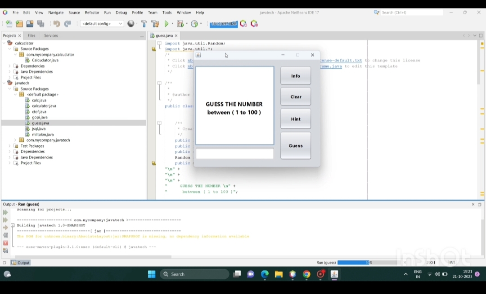

# Guess the Number Game

## Overview

This is a simple "Guess the Number" game developed using Java Swing. The game generates a random number, and the player has to guess it within a specified range. The game provides real-time feedback on whether the guess is too high, too low, or correct.

## Features

- User-friendly interface built with Java Swing
- Random number generation within a specified range
- Interactive feedback on user guesses
- Reset functionality to start a new game

## Demo

Check out the functionality of the game in this demo video:[watch here](https://youtu.be/oIQ_EkJ0vhY)

## Screenshot



## Getting Started

### Prerequisites

- Java Development Kit (JDK) installed
- An IDE like IntelliJ IDEA, Eclipse, or NetBeans

### Installation

1. Clone the repository:
   ```sh
   git clone https://github.com/Tulaseeram-panga/Guessthenumber.git
   ```
2. Open the project in your preferred IDE.

### Running the Game

1. Navigate to the `src` folder.
2. Run the `Main.java` file.

### How to Play

1. Enter your guess in the provided input field.
2. Click the "Guess" button to submit your guess.
3. The game will provide feedback on whether your guess is too high, too low, or correct.
4. Click the "clear" button to start a new game.

## Contributing

If you'd like to contribute to this project, please fork the repository and submit a pull request. Contributions are welcome!

## License

This project is licensed under the MIT License. See the [LICENSE](LICENSE) file for more details.

## Contact

- GitHub: [yourusername](https://github.com/Tulaseeram-panga)
- Twitter: [@yourtwitterhandle](https://twitter.com/tulaseerampanga)
